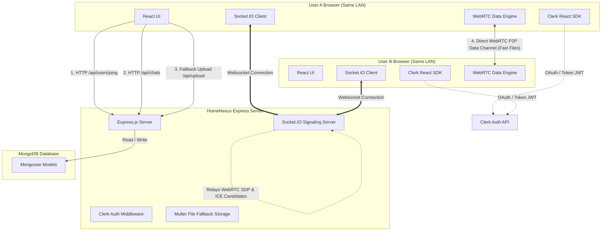
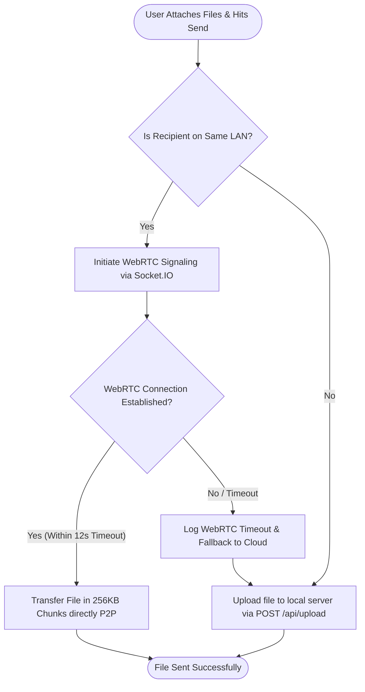

# HomeNexus — Private Local LAN Chat & Hybrid WebRTC File Transfer 🏡🚀

**HomeNexus** is a WhatsApp-inspired real-time private chat application designed for home networks. It enables users on the same WiFi/LAN network to discover each other automatically, start instant direct message rooms, and transfer files at gigabit speeds directly between their browsers using **WebRTC Data Channels**, with an Express-based cloud upload fallback for out-of-network transfers.

---

## 🏗️ System Architecture & Connection Flow

HomeNexus uses a hybrid networking model. It combines a central server for authentication, REST API requests, and Socket.IO signaling with direct peer-to-peer (P2P) connections for ultra-fast file transfer.

### 1. General System Architecture
The diagram below illustrates how components interact:
* **HTTP APIs** are used for user syncs, health checks, and historical message logging.
* **Socket.IO** manages real-time messaging, typing events, and WebRTC handshakes (SDP offers/answers and ICE Candidates).
* **WebRTC Data Channels** are opened directly between browsers for same-LAN file transmissions, bypassing the server completely.



### 2. Hybrid File Transfer Pipeline (P2P with Cloud Fallback)
When a file is sent, HomeNexus determines if it can establish a direct P2P link or if it needs to fallback to storing the file on the server:



---

## 🛠️ The Tech Stack

| Technology | Role in Application | Detailed Purpose |
| :--- | :--- | :--- |
| **React (v18)** | Frontend UI | Powers the Neo-brutalist dashboard, message feeds, and interactive sidebar. |
| **Node.js & Express** | Server Engine | Serves API routes, handles files, and hosts WebSockets. |
| **MongoDB & Mongoose** | Persistent Storage | Stores user profiles, messaging history, and file metadata documents. |
| **Clerk React & Express** | Secure Authentication | Manages user login sessions, signup routing, and secure API JWT authorization. |
| **Socket.IO** | Real-time WebSockets | Relays instant text chat messages, typing events, and WebRTC handshakes. |
| **WebRTC API** | P2P Data Channels | Transmits files directly between LAN clients, bypassing server bandwidth limits. |
| **Multer** | Multipart Form Parser | Handles file upload streaming to server storage when WebRTC fallback is active. |

---

## 🌟 Key Features

* **Clerk Identity Verification**: Users log in securely via Clerk's official React widgets. Secure endpoints on the backend decrypt and verify the session token JWT.
* **Auto-Discovery (LAN Pings)**: The client checks the server (`POST /api/users/ping`) which logs their public IP. The search interface allows filtering users with a **"Same LAN only"** filter.
* **Smart File Multi-tasking**:
  * Select and queue **multiple files** to send at once.
  * In-progress transfers run as concurrent asynchronous operations, letting you **switch chat rooms** while the transfer continues in the background.
* **WebRTC Chunking & Flow Control**: Direct files are sliced into `256KB` buffer arrays. The engine monitors `bufferedAmount` to adjust speeds dynamically and prevent browser buffer overflow.
* **Auto-Focus Chatbox**: The message entry field focuses automatically when switching rooms or attaching files for a faster, keyboard-centric chat flow.

---

## 🚀 Download & Installation Guide

### 1. Clone the Repository
```bash
git clone https://github.com/mohit-79/Jacked-chat-app.git
cd Jacked-chat-app-main
```

### 2. Backend Setup (`backend-node`)
1. Navigate to the backend directory:
   ```bash
   cd backend-node
   ```
2. Install dependencies:
   ```bash
   npm install
   ```
3. Create a `.env` file:
   ```env
   PORT=8001
   MONGO_URL="your-mongodb-connection-string"
   DB_NAME="test_database"
   CORS_ORIGIN="http://localhost:3000"

   # Clerk Authentication Keys (From your Clerk Dashboard)
   CLERK_PUBLISHABLE_KEY=pk_test_...
   CLERK_SECRET_KEY=sk_test_...
   ```
4. Run in development mode:
   ```bash
   npm run dev
   ```

### 3. Frontend Setup (`frontend`)
1. Navigate to the frontend directory:
   ```bash
   cd ../frontend
   ```
2. Install dependencies:
   ```bash
   npm install
   ```
3. Create a `.env` file:
   ```env
   REACT_APP_BACKEND_URL=http://localhost:8001
   REACT_APP_CLERK_PUBLISHABLE_KEY=pk_test_...
   ```
4. Run in development mode:
   ```bash
   npm start
   ```

---

## 📁 Key File Structure

```
backend-node/
  server.js             # Express entry point: registers routes, CORS, and binds Socket.IO signaling
  config/
    db.js               # MongoDB Mongoose connection config
    multer.js           # Multer storage config for cloud file upload fallback
  models/
    User.js             # Schema storing Clerk IDs and public IPs for LAN matching
    Message.js          # Schema storing messages in snake_case format
    File.js             # Schema storing metadata of local server upload fallbacks
  routes/
    users.js            # User pings, profile syncs, and LAN searches
    chats.js            # DM routing, room queries, and history aggregation
    files.js            # Server upload fallbacks and secure download streams
  sockets/
    socketManager.js    # Auth verification middleware and WebRTC signal relay loops

frontend/src/
  App.js                # App route mapping and Clerk Provider configuration
  context/
    AuthContext.jsx     # Backward-compatible hook adapter bridging local contexts to Clerk API
  lib/
    api.js              # Axios interceptors adding Clerk Bearer JWT tokens dynamically
    websocket.js        # Socket.IO React hook handling signals and typing events
    webrtc.js           # WebRTC chunk reader and channel buffering coordinator
  components/
    Sidebar.jsx         # Search and active chat rooms list with LAN filter
    ChatPanel.jsx       # Chat UI, multi-file previewer, and input ref controllers
  pages/
    AppShell.jsx        # Shell dashboard routing chats, websocket connections, and file sends
```

---

