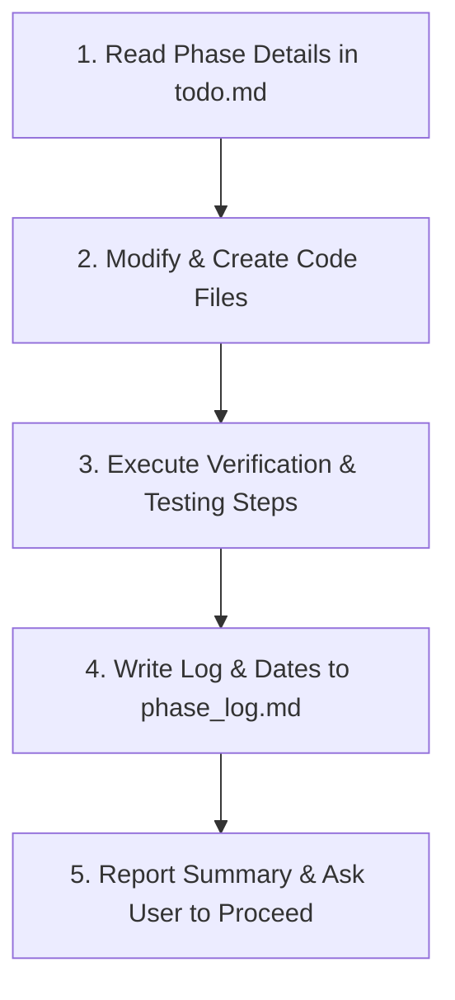

# AI Agent Execution Instructions — HomeNexus Lite Migration 🤖

This document provides strict operational instructions for any AI assistant or subagent executing the code migration of **HomeNexus** to **HomeNexus Lite**. Follow these guidelines to ensure reliability, correctness, and transparency throughout the development cycle.

---

## 📋 The Core Mandate

1. **Step-by-Step Execution**: You must read and follow the plan defined in [todo.md](file:///home/harjani/Desktop/anti/Jacked-chat-app-main/hfolder/todo.md). Do **not** skip phases or start a new phase until the current one is completed, tested, and logged.
2. **Progress Logging**: Immediately after completing and validating a phase, you must update the tracker table and phase logs inside [phase_log.md](file:///home/harjani/Desktop/anti/Jacked-chat-app-main/hfolder/phase_log.md).
3. **Reference Architecture**: Refer to [simple_guide.md](file:///home/harjani/Desktop/anti/Jacked-chat-app-main/hfolder/simple_guide.md) for architectural guidelines, database schemas, and signaling details.

---

## 🔄 The Iterative Workflow (The 5-Step Loop)

For each phase in [todo.md](file:///home/harjani/Desktop/anti/Jacked-chat-app-main/hfolder/todo.md), you must execute this loop:

### 1. Read & Plan
- Open [todo.md](file:///home/harjani/Desktop/anti/Jacked-chat-app-main/hfolder/todo.md) and navigate to the current target phase.
- List all files that need to be created or modified in this phase.
- Review any code symbols or files in the existing codebase that might be affected.

### 2. Implement Changes
- Write clean, modular, and well-commented code.
- If creating new folders (like `backend-node/`), ensure all necessary initial configurations (like `package.json` and environmental `.env.example` templates) are written.
- Ensure Clerk authentication validation is integrated correctly on both client and server side.

### 3. Test & Verify
- Run the code compilation, database tests, or manual endpoint calls as outlined in the **"How to Test"** section of the current phase.
- Log console errors, response statuses, and database entries to ensure everything works as expected.

### 4. Log Progress
- Open [phase_log.md](file:///home/harjani/Desktop/anti/Jacked-chat-app-main/hfolder/phase_log.md).
- Update the main status tracker table (change the status of the completed phase to `✅ Completed` and record the start and completion timestamps).
- Write down the specific logs, files created, issues encountered (and how you solved them), and integration test results in the respective phase log section.

### 5. Report & Sync
- Summarize the accomplishments of the completed phase.
- Explicitly ask the user for permission or confirmation before initiating the next phase.

---

## ⚠️ Important Rules for Agents
* **Do Not Delete Original Files Immediately**: Keep a backup or comment out code that is being replaced (especially in complex files like [AppShell.jsx](file:///home/harjani/Desktop/anti/Jacked-chat-app-main/frontend/src/pages/AppShell.jsx) and [ChatPanel.jsx](file:///home/harjani/Desktop/anti/Jacked-chat-app-main/frontend/src/components/ChatPanel.jsx)) until the new Express-based flows are confirmed stable.
* **Keep Code Clickable**: In all user responses, always format file paths and symbols as clickable markdown links (e.g. `[server.js](file:///absolute/path/to/server.js)`).
* **Handle Errors Gracefully**: Ensure that both client-side API requests and server-side route controllers catch, log, and respond to errors gracefully so that the application UI doesn't freeze or crash.
