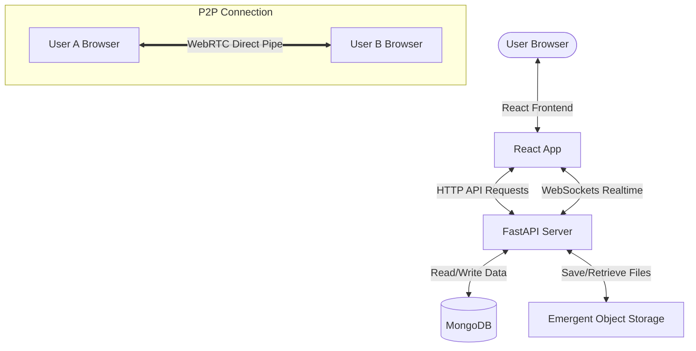
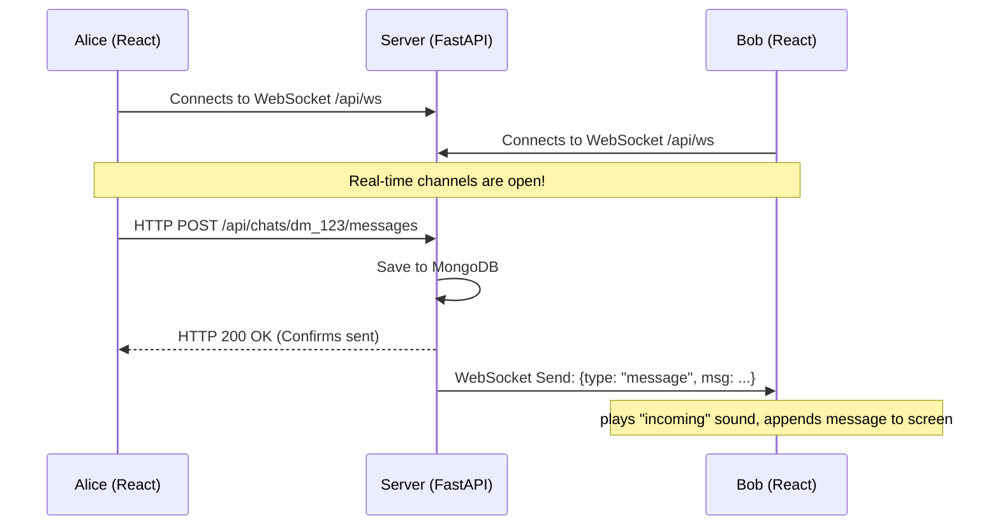
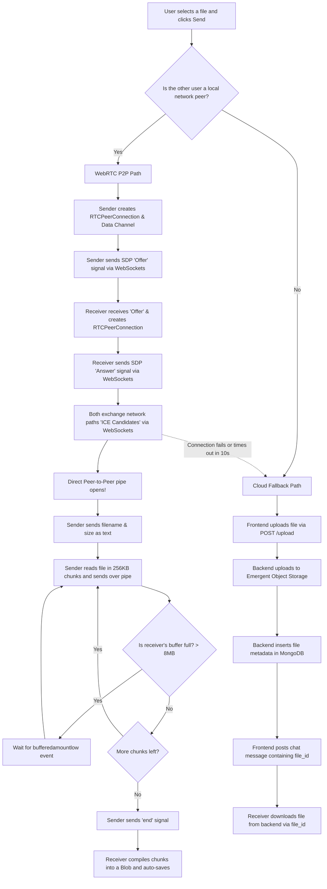

# HomeNexus — The Complete Beginner's Guide 🏡🚀

Welcome to **HomeNexus**! If you are a beginner web developer looking to understand how this WhatsApp-like chat and file-transfer application works, you've come to the right place. 

This guide breaks down every complex concept into simple terms, uses visual flowcharts, and walks you through the code step-by-step. By the end of this guide, you will know exactly **what** happens, **how** it happens, and **why** the code is written the way it is.

---

## Table of Contents
1. [The Big Picture (Architecture)](#1-the-big-picture-architecture)
2. [Everyday Analogies for Core Concepts](#2-everyday-analogies-for-core-concepts)
3. [The Technology Stack](#3-the-technology-stack)
4. [Step-by-Step Feature Flows](#4-step-by-step-feature-flows)
   - [Flow A: Authentication (Signing In)](#flow-a-authentication-signing-in)
   - [Flow B: Real-Time Communication (WebSockets)](#flow-b-real-time-communication-websockets)
   - [Flow C: Finding WiFi Peers (Local Discovery)](#flow-c-finding-wifi-peers-local-discovery)
   - [Flow D: Magic File Transfer (WebRTC vs. Cloud Fallback)](#flow-d-magic-file-transfer-webrtc-vs-cloud-fallback)
   - [Flow E: 24-Hour Stories](#flow-e-24-hour-stories)
   - [Flow F: Friends System](#flow-f-friends-system)
5. [The Map of the Codebase](#5-the-map-of-the-codebase)
6. [How to Run it Locally](#6-how-to-run-it-locally)

---

## 1. The Big Picture (Architecture)

HomeNexus runs on a **Client-Server Architecture**. 

* **The Frontend (Client)**: The React app running in the user's browser. It provides the visual buttons, inputs, stories feed, and manages the camera or file picker.
* **The Backend (Server)**: The Python FastAPI application. It is the middleman that accepts requests, coordinates database transactions, handles WebSockets, and relays signaling data.
* **The Database (Storage)**: A MongoDB database that acts as the persistent brain. It remembers who you are, your friends, and your chat logs.



---

## 2. Everyday Analogies for Core Concepts

Before we look at the code, let's understand three main terms you'll see in the code:

### HTTP / REST (Axios)
* **Analogy**: Ordering food at a restaurant.
* **Explanation**: You (the frontend) make a request (e.g., "Give me my profile details" or "Post this message"). The waiter (backend) goes to the kitchen (database) and brings back your plate (JSON response). The connection closes as soon as you get your response.

### WebSockets
* **Analogy**: A phone call that stays active.
* **Explanation**: Instead of ordering food and hanging up, WebSockets establish an open line. Once connected, either side can send messages immediately. The backend can tell the frontend "Hey, you got a new message!" without the frontend having to ask.

### WebRTC (Web Real-Time Communication)
* **Analogy**: Throwing a physical letter over the fence directly to your neighbor.
* **Explanation**: Normally, if you send a file, you upload it to a server (like Google Drive) and your friend downloads it. WebRTC lets two browsers connect **directly to each other** to transfer files. It is ultra-fast because the file never touches any server. It goes straight over your home WiFi!

---

## 3. The Technology Stack

Here is what we use and why:

* **React (JS Framework)**: Handles the UI. We use standard hooks like `useState` (to store variables in memory), `useEffect` (to run code when the page loads), and `useRef` (to reference HTML elements like file pickers directly).
* **FastAPI (Python Web Framework)**: The backend web framework. It is chosen because it is incredibly fast, easy to write, and has built-in support for asynchronous programming (`async/await`) and WebSockets.
* **MongoDB (Database)**: A NoSQL database that stores data in JSON-like documents. We use `motor` to read/write from MongoDB asynchronously in Python.
* **Bcrypt & JWT**: 
  - **Bcrypt** scrambles (hashes) user passwords so if the database is leaked, passwords are safe.
  - **JWT (JSON Web Tokens)** are digital entry passes. Once you log in, the server gives you a JWT. The frontend attaches it to every request to prove you are logged in.
* **Tailwind CSS**: A utility-first CSS framework used for styling (giving it a clean, WhatsApp-like design).

---

## 4. Step-by-Step Feature Flows

Let's look at exactly what happens under the hood during the most important actions.

---

### Flow A: Authentication (Signing In)

You can sign in using an **email/password** or **Google Login**. Here is how both work:

#### 1. Email/Password (Local Auth)
1. You fill out the login form in [Login.jsx](file:///home/harjani/Desktop/anti/Jacked-chat-app-main/frontend/src/pages/Login.jsx) and press submit.
2. The frontend sends an HTTP `POST` request to `/api/auth/login` containing your email and password.
3. In [server.py](file:///home/harjani/Desktop/anti/Jacked-chat-app-main/backend/server.py#L255-L268), the backend:
   - Fetches the user document from MongoDB.
   - Verifies the password using `bcrypt.checkpw(...)`.
   - Generates a **JWT token** containing your `user_id`.
4. The backend sends the JWT back to the frontend.
5. The frontend saves the token in `localStorage` under the key `"hn_token"`.
6. To make sure you stay logged in, an **Axios Interceptor** (located in [api.js](file:///home/harjani/Desktop/anti/Jacked-chat-app-main/frontend/src/lib/api.js#L11-L18)) automatically intercepts every outgoing request and adds:
   `Authorization: Bearer <hn_token>` to the HTTP headers.

#### 2. Google OAuth (Emergent Agent Login)
1. In [Login.jsx](file:///home/harjani/Desktop/anti/Jacked-chat-app-main/frontend/src/pages/Login.jsx#L53-L56), clicking "Continue with Google" redirects you to a secure login page: `https://auth.emergentagent.com/?redirect=...`.
2. Once you log in successfully via Google, it redirects you back to HomeNexus at `/app#session_id=XYZ`.
3. The frontend router [App.js](file:///home/harjani/Desktop/anti/Jacked-chat-app-main/frontend/src/App.js#L28-L30) detects this `#session_id=` and mounts [AuthCallback.jsx](file:///home/harjani/Desktop/anti/Jacked-chat-app-main/frontend/src/pages/AuthCallback.jsx).
4. [AuthCallback.jsx](file:///home/harjani/Desktop/anti/Jacked-chat-app-main/frontend/src/pages/AuthCallback.jsx#L20-L28) extracts the session ID and sends it to the backend endpoint `/api/auth/session`.
5. The backend calls the authentication provider, verifies the session, registers the user in MongoDB if they are new, and returns a session token.
6. The frontend saves this token and redirects you to the main chat dashboard.

---

### Flow B: Real-Time Communication (WebSockets)

How do messages show up instantly without reloading the page?

1. As soon as you log in, [AppShell.jsx](file:///home/harjani/Desktop/anti/Jacked-chat-app-main/frontend/src/pages/AppShell.jsx#L217) calls the `useWebSocket` hook (from [websocket.js](file:///home/harjani/Desktop/anti/Jacked-chat-app-main/frontend/src/lib/websocket.js)).
2. The hook opens a WebSocket connection to the backend at `ws://your-backend-ip/api/ws?token=XYZ`. Note that we pass the token in the URL query parameters because browsers don't support custom headers on WebSockets.
3. The backend [server.py](file:///home/harjani/Desktop/anti/Jacked-chat-app-main/backend/server.py#L692-L734) checks the token. If valid, it adds the connection to a `ConnectionManager` class, which keeps track of all active browser tabs connected to the server.
4. When a user clicks send:
   - The frontend sends the message via HTTP `POST` to `/api/chats/{chat_id}/messages`.
   - The backend inserts the message into MongoDB.
   - The backend then tells the `ConnectionManager` to broadcast this message to the recipients' open WebSockets.
   - The recipient's browser hears the WebSocket event, plays an incoming sound effect (`playSound("incoming")`), and appends the new message to the screen.



---

### Flow C: Finding WiFi Peers (Local Discovery)

HomeNexus is designed to let you easily share files with people on the **same home network (WiFi)**. How does it find them?

1. When you log in, register, or make requests, the backend checks your **Public IP Address** (the address your ISP gives to your router). If you are on the same WiFi, your public IP addresses will match!
2. You can also specify an optional **Home group code** (like `my-awesome-flat` or `home-wifi`) in your profile.
3. In [server.py](file:///home/harjani/Desktop/anti/Jacked-chat-app-main/backend/server.py#L357-L371), calling `/api/network/peers` finds other users who:
   - Share the exact same public IP, **OR**
   - Share the exact same Home group code.
4. The frontend displays these users in the Sidebar and Profile pages with a green **"FAST"** or **"WebRTC ready"** badge, meaning you can send files directly between your computers.

---

### Flow D: Magic File Transfer (WebRTC vs. Cloud Fallback)

This is the most advanced part of the application. When you attach a file to a message, the app decides whether to send it **directly (P2P)** or **upload it to the cloud**.



#### Detailed Breakdown:

#### 1. The WebRTC P2P Path (Direct connection)
If you are chatting with a local peer, the app uses [webrtc.js](file:///home/harjani/Desktop/anti/Jacked-chat-app-main/frontend/src/lib/webrtc.js):
* **Signaling (The Handshake)**:
  Browsers cannot just connect to each other out of nowhere; they need to exchange network metadata first. This exchange is called **signaling** and is done using our existing WebSocket connection:
  1. **Offer**: The Sender creates an `RTCPeerConnection` and a `RTCDataChannel` (named `"file"`). It creates a description of its media/settings (an SDP **Offer**) and sends it to the Receiver via a WebSocket signal.
  2. **Answer**: The Receiver gets the Offer, creates its own `RTCPeerConnection`, and replies with an SDP **Answer** via a WebSocket signal.
  3. **ICE Candidates**: Both browsers ask a Google STUN server (`stun.l.google.com`) to find their public connection details (IP address and ports). They exchange these details (called **ICE Candidates**) via WebSockets.
  4. **Connection established**: Once a path is found, the browsers connect **directly** to each other, and the WebSocket server is no longer involved.
* **The Transfer**:
  1. The Sender sends a small text message containing the file name and size.
  2. The Sender reads the file using `FileReader` in **256KB chunks**.
  3. The Sender writes these chunks to the WebRTC Data Channel.
  4. **Flow Control (Backpressure)**: If you write data to a network connection faster than it can send, your browser's memory will crash. The app prevents this:
     - If the data channel's `bufferedAmount` goes above **8MB** (high watermark), it pauses sending.
     - Once the buffer empties down to **1MB** (low watermark), the browser fires a `bufferedamountlow` event, and the code resumes reading and sending chunks.
  5. **Completion**: Once the last chunk is sent, the Sender transmits an `{"kind": "end"}` message. The Receiver takes all the gathered chunks, combines them into a single `Blob` (Binary Large Object), creates a local URL using `URL.createObjectURL(blob)`, and triggers a download toast so the user can save it.

#### 2. The Cloud Fallback Path
If you are not on the same network, or if the WebRTC connection fails/times out, the app automatically switches to the cloud:
1. The frontend uploads the file using standard multipart form data via `POST /api/upload`.
2. In the backend, `server.py` receives the file, pushes it to the **Emergent Object Storage** cloud, and inserts a file record into MongoDB.
3. The backend returns a `file_id`.
4. The frontend then sends a normal chat message containing this `file_id`.
5. The recipient's browser renders this message as a link or image preview. The file is downloaded from the backend using `/api/files/{file_id}/download?auth=<token>`.

---

### Flow E: 24-Hour Stories

Like WhatsApp Status or Instagram Stories, you can post temporary photos/videos:

1. **Creating**: Clicking "New story" lets you pick a file. You are prompted to choose whether to share it with "friends-only" or "public".
2. **Uploading**: The file is uploaded to the backend and stored in the cloud (similar to the Cloud File flow).
3. **Saving**: The backend saves a document in the `stories` database collection. Crucially, it sets:
   `expires_at = current_time + 24 hours`
4. **Listing**: When users load the Stories tab, the backend query runs:
   `db.stories.find({"expires_at": {"$gt": current_time}})`
   This automatically filters out any story older than 24 hours!
5. **Viewing**: When you click to watch someone's story, the frontend plays it in a viewer. Every time a story is loaded, it sends a request to `/api/stories/{story_id}/view` to add your user ID to the story's `viewers` list. The owner can see their total view count.

---

### Flow F: Friends System

To restrict stories visibility or start direct conversations easily, you can send friend requests:

1. You click "Add Friend" on a user in the network list.
2. The frontend calls `/api/friends/request` with their `user_id`.
3. The backend checks if you are already friends or have a pending request. If not, it creates a request document in the `friend_requests` database collection with `status: "pending"`.
4. The recipient is notified and sees the request on their Profile page under "Friend requests".
5. If they click **Accept**:
   - The request status is updated to `"accepted"`.
   - A new friendship document is created in the `friendships` collection containing `users: [user_id_a, user_id_b]`.
6. Now, you can see each other's "friends-only" stories!

---

## 5. The Map of the Codebase

Here is where the actual code files live and what they contain:

### 📁 `backend/`
* [server.py](file:///home/harjani/Desktop/anti/Jacked-chat-app-main/backend/server.py): The entire backend! It handles API endpoints, authentication checks, MongoDB connections, WebSockets, and WebRTC signaling logic.
* `requirements.txt`: List of Python libraries needed (FastAPI, PyJWT, Motor, Bcrypt, Uvicorn, etc.).

### 📁 `frontend/src/`
* [App.js](file:///home/harjani/Desktop/anti/Jacked-chat-app-main/frontend/src/App.js): The main entry point. Sets up the URL Router, wraps the app in the authentication provider, and handles Google login redirects.
* [index.css](file:///home/harjani/Desktop/anti/Jacked-chat-app-main/frontend/src/index.css): Contains custom Tailwind styles and animations (like `bubble-in` and `fade-in`).

#### 📁 `frontend/src/context/`
* [AuthContext.jsx](file:///home/harjani/Desktop/anti/Jacked-chat-app-main/frontend/src/context/AuthContext.jsx): Stores the active user details in React state, manages login, registration, and logout API requests.

#### 📁 `frontend/src/lib/`
* [api.js](file:///home/harjani/Desktop/anti/Jacked-chat-app-main/frontend/src/lib/api.js): Sets up the Axios library, attaches JWT authorization headers automatically, and exports helper functions for file downloads.
* [websocket.js](file:///home/harjani/Desktop/anti/Jacked-chat-app-main/frontend/src/lib/websocket.js): React Hook that connects to the backend WebSocket server and automatically tries to reconnect if the internet drops.
* [webrtc.js](file:///home/harjani/Desktop/anti/Jacked-chat-app-main/frontend/src/lib/webrtc.js): Handles creating connections, generating offers/answers, sending file metadata, and breaking down files into chunks to send them P2P.

#### 📁 `frontend/src/pages/`
* [Login.jsx](file:///home/harjani/Desktop/anti/Jacked-chat-app-main/frontend/src/pages/Login.jsx): The login and registration screen. Beautifully designed layout featuring both credential and Google single-sign-on (SSO).
* [AppShell.jsx](file:///home/harjani/Desktop/anti/Jacked-chat-app-main/frontend/src/pages/AppShell.jsx): The core layout manager. Keeps track of open chats, listens to incoming WebSocket messages, and handles initiating WebRTC or cloud file sends.
* [ProfilePage.jsx](file:///home/harjani/Desktop/anti/Jacked-chat-app-main/frontend/src/pages/ProfilePage.jsx): Lets users change their name/bio, upload an avatar, view local peers, and accept friend requests.
* [StoriesPage.jsx](file:///home/harjani/Desktop/anti/Jacked-chat-app-main/frontend/src/pages/StoriesPage.jsx): The stories list page and story viewer player.

#### 📁 `frontend/src/components/`
* [ChatPanel.jsx](file:///home/harjani/Desktop/anti/Jacked-chat-app-main/frontend/src/components/ChatPanel.jsx): Renders the conversation screen. Handles text inputs, file drag-and-drop/selection, and draws custom file bubbles (with progress percentage bars).
* [Sidebar.jsx](file:///home/harjani/Desktop/anti/Jacked-chat-app-main/frontend/src/components/Sidebar.jsx): The left panel showing active conversations, unread badge counts, and buttons to open profile/stories.
* [FriendsPanel.jsx](file:///home/harjani/Desktop/anti/Jacked-chat-app-main/frontend/src/components/FriendsPanel.jsx): Overlay panel to search for users and send new friend requests.

---

## 6. How to Run it Locally

Ready to try running it on your own machine? Follow these simple terminal steps:

### Prerequisites
1. **Node.js** (v16 or higher) installed on your computer.
2. **Python** (v3.8 or higher) installed.
3. **MongoDB** running locally or a free cloud URI from MongoDB Atlas.

### Step 1: Run the Backend
1. Open your terminal and navigate to the backend folder:
   ```bash
   cd backend
   ```
2. Install the Python packages:
   ```bash
   pip install -r requirements.txt
   ```
3. Create a `.env` file inside the `backend` folder and add your configuration details:
   ```env
   MONGO_URL=mongodb://localhost:27017
   DB_NAME=homenexus
   JWT_SECRET=super-secret-key-change-me
   EMERGENT_LLM_KEY=your-optional-key
   APP_NAME=homenexus
   ```
4. Start the FastAPI development server:
   ```bash
   uvicorn server:app --reload --port 8001
   ```
   *Your backend is now running at `http://localhost:8001`!*

### Step 2: Run the Frontend
1. Open a new terminal window and navigate to the frontend folder:
   ```bash
   cd frontend
   ```
2. Install the Node packages:
   ```bash
   npm install
   ```
3. Create a `.env` file inside the `frontend` folder to point to your backend:
   ```env
   REACT_APP_BACKEND_URL=http://localhost:8001
   ```
4. Start the React development server:
   ```bash
   npm start
   ```
   *Your web browser should automatically open `http://localhost:3000`!*

---

## Summary of the Code Lifecycle
When you send a message with a file attachment:
1. `ChatPanel.jsx` reads the selected file.
2. `AppShell.jsx` launches the upload process.
3. If the user is on your local network, `webrtc.js` sets up a connection via signaling through `server.py`'s WebSockets, and then beams the file directly chunk-by-chunk.
4. If they are not on your network, `api.js` uploads it to the backend `server.py` `/api/upload` route, which writes it to the cloud.
5. The recipient's `ChatPanel.jsx` draws the message bubble, downloading the file from the cloud or downloading the compiled WebRTC `Blob` directly from memory.

You are now ready to hack on HomeNexus! If you have any questions, feel free to inspect the files linked in the codebase map above. Happy coding! 💻✨
