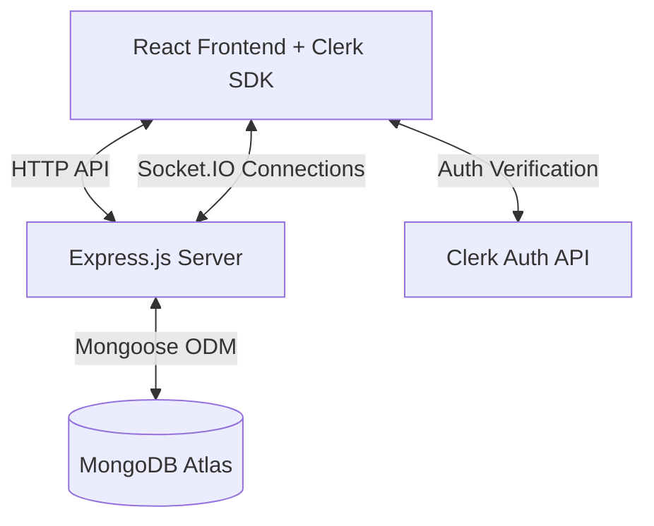

# HomeNexus Lite — Simplified Developer & Interview Guide 🚀

This guide outlines a simplified, streamlined version of HomeNexus optimized for coding interviews. The goal is to maximize performance, security, and developer speed while keeping the architecture clean and easy to explain to an interviewer in under 5 minutes.

---

## 1. Core Changes at a Glance

| Feature | Original App | Simplified App (Lite) | Why? |
| :--- | :--- | :--- | :--- |
| **Authentication** | Custom JWT + Bcrypt + Google Session API | **Clerk SDK** (Frontend & Backend middleware) | Offloads passwords, tokens, OAuth, and UI forms to a production-grade provider. Zero auth code to maintain. |
| **Stories & Friends** | 24h stories, viewers list, pending/accepted requests | **Removed** | Reduces database complexity, API routes, and state management overhead. |
| **User Discovery** | Peer list based on IP + Group Code | **Search Input** with a **"Same LAN only"** toggle | Keeps the UI cleaner. Filtering is done by matching the user's public IP address on the backend. |
| **Chat Management** | Complex pipeline grouping | Simple **Recent Chats** list | Displays only conversations you have previously started or received. |
| **Backend Stack** | FastAPI + Motor (Python) | **Node.js + Express.js + Mongoose** | Node/Express is the most common industry-standard tech stack for web interviews. |
| **Real-time Engine** | Raw WebSockets | **Socket.IO** | Socket.IO manages automatic reconnects, heartbeats, and room namespaces out-of-the-box. |

---

## 2. Proposed System Architecture: Express + Socket.IO + MongoDB Stack

This is a standard, robust stack. The server handles API requests, WebSocket rooms, and database writes.



* **Frontend**: React, Clerk React SDK (for `<SignIn />` and `useAuth()`), Socket.IO-client, Simple CSS.
* **Backend**: Express.js, Clerk Express middleware (to secure API routes), Socket.IO (for signaling & real-time messaging), Mongoose (to talk to MongoDB).
* **Database**: MongoDB (stores `users` and `messages`).

---

## 3. Simplified Database Schema (Mongoose)

With stories and friends removed, you only need two simple database collections:

### 1. User Schema (`users`)
```javascript
const userSchema = new mongoose.Schema({
  clerkId: { type: String, required: true, unique: true }, // Clerk's unique user identifier
  email: { type: String, required: true },
  name: { type: String, required: true },
  picture: String,
  publicIp: String,      // Used to detect if users are on the same local network
  lastSeen: { type: Date, default: Date.now }
});
```

### 2. Message Schema (`messages`)
To keep recent chats easy to retrieve, each message is tagged with the two participant IDs.
```javascript
const messageSchema = new mongoose.Schema({
  senderId: { type: String, required: true },
  receiverId: { type: String, required: true },
  content: String,
  fileMeta: {
    filename: String,
    size: Number,
    contentType: String
  },
  transferMode: { type: String, enum: ['webrtc', 'cloud'], default: 'webrtc' },
  createdAt: { type: Date, default: Date.now }
});
```

---

## 4. How the Simplified Flows Work

### A. Authentication with Clerk
1. The frontend wraps the app in `<ClerkProvider>`.
2. The user signs in using Clerk's pre-built `<SignIn />` button.
3. Once logged in, Clerk manages session tokens in the browser.
4. When making API requests, the React app retrieves a token using `await getToken()` and attaches it as a Bearer token in the header.
5. In Express, the Clerk middleware decrypts the token:
   ```javascript
   import { LooseAuthProp } from '@clerk/clerk-sdk-node';
   app.get('/api/chats', requireAuth(), async (req, res) => {
     const userId = req.auth.userId; // Securely verified Clerk User ID
     // Fetch chats for this user...
   });
   ```

### B. Same-LAN Peer Detection
1. When a user opens the app, the frontend hits an endpoint `/api/users/ping`.
2. The backend gets the client's public IP address (using `req.ip` or checking the `x-forwarded-for` header if behind a proxy) and saves it to the user's document in MongoDB.
3. When you search for users, you can toggle the "Same LAN" filter. The frontend sends a query to the backend: `/api/users?search=alex&sameLan=true`.
4. If `sameLan` is true, the Express backend queries MongoDB for users whose `publicIp` matches the current logged-in user's IP.

### C. WebRTC Signaling via Socket.IO
When two users on the same LAN share a file, they establish a WebRTC connection. They use Socket.IO to exchange connection details:
1. **Join Room**: When Socket.IO connects, every user joins a socket room named after their unique Clerk ID: `socket.join(user.clerkId)`.
2. **Send Signal**: To initiate a file transfer, the Sender sends a socket event:
   ```javascript
   // Frontend
   socket.emit("signal", { targetId: "user_bob", signalData: offerSdp });
   ```
3. **Relay Signal**: The Express server catches this and relays it directly to Bob's room:
   ```javascript
   // Backend
   socket.on("signal", ({ targetId, signalData }) => {
     io.to(targetId).emit("signal", { senderId: socket.userId, signalData });
   });
   ```
4. Once the handshake is complete, the file binary is transferred directly between browsers in 256KB chunks over WebRTC (exactly as detailed in the original [guide.md](file:///home/harjani/Desktop/anti/Jacked-chat-app-main/hfolder/guide.md#flow-d-magic-file-transfer-webrtc-vs-cloud-fallback)).

---

## 5. Interview Talking Points (Pro-Tips)

When presenting this project to an interviewer, use these talking points to showcase your technical decision-making:

* **"Why Clerk instead of custom JWT?"**
  > *"I chose Clerk for authentication because writing custom session management and token renewal from scratch is a solved security problem. Offloading it to Clerk gives us secure password hashing, social logins, and token verification out-of-the-box, allowing us to focus on the core business logic: P2P file transfers."*
  
* **"Why WebRTC for file sharing?"**
  > *"Instead of routing large file uploads through a server (which consumes expensive bandwidth and introduces cloud storage latency), we use WebRTC. If both clients are on the same local network, they connect directly. This results in gigabit-speed transfers, complete privacy, and zero server hosting costs."*

* **"Why Socket.IO over raw WebSockets?"**
  > *"Socket.IO abstracts away connection drop-outs, manages reconnection attempts with exponential backoff, and provides a simple 'rooms' abstraction. This makes signaling robust and significantly reduces the amount of boilerplate code we need to maintain."*

* **"How do you fetch previous chats?"**
  > *"We run an aggregation query in MongoDB to get a list of unique users the logged-in user has exchanged messages with, sorted by the timestamp of the most recent message. This mimics a real-world chat list without the complexity of maintaining separate conversation rooms."*

---

## 6. How to Run the Lite Version Locally

### 1. Start the Backend (`backend-node`)
1. Open your terminal and navigate to the backend folder:
   ```bash
   cd backend-node
   ```
2. Start the development server (runs nodemon):
   ```bash
   npm run dev
   ```
   *The backend starts on `http://localhost:8001`!*

### 2. Start the Frontend (`frontend`)
1. Open a new terminal window and navigate to the frontend folder:
   ```bash
   cd frontend
   ```
2. Start the React development server:
   ```bash
   npm run dev
   ```
   *The frontend starts on `http://localhost:3000`!*
